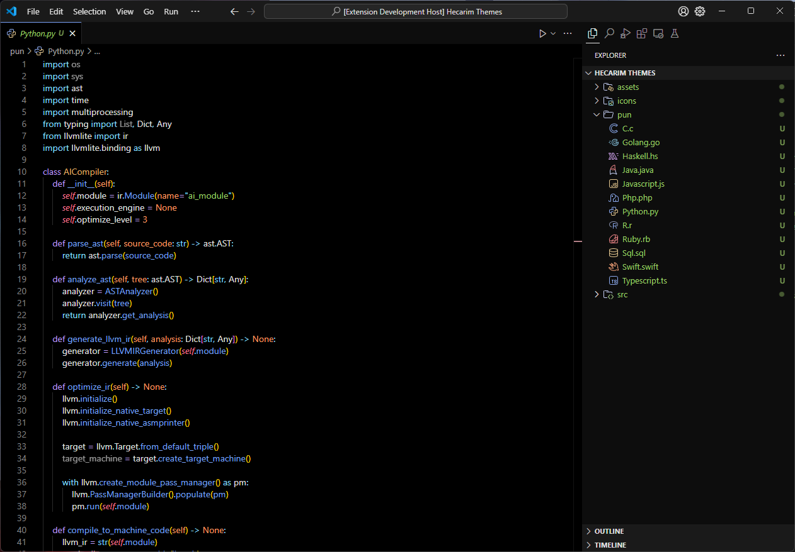
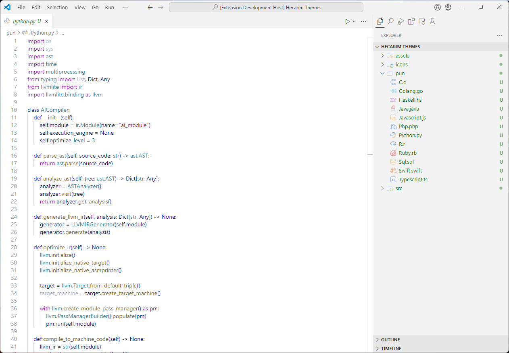
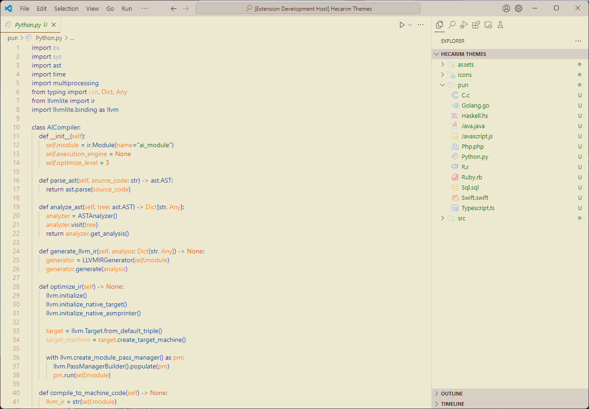
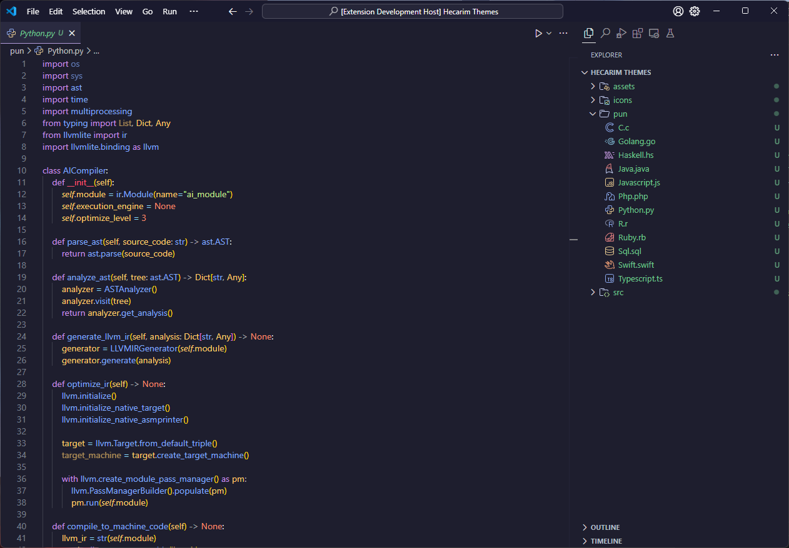
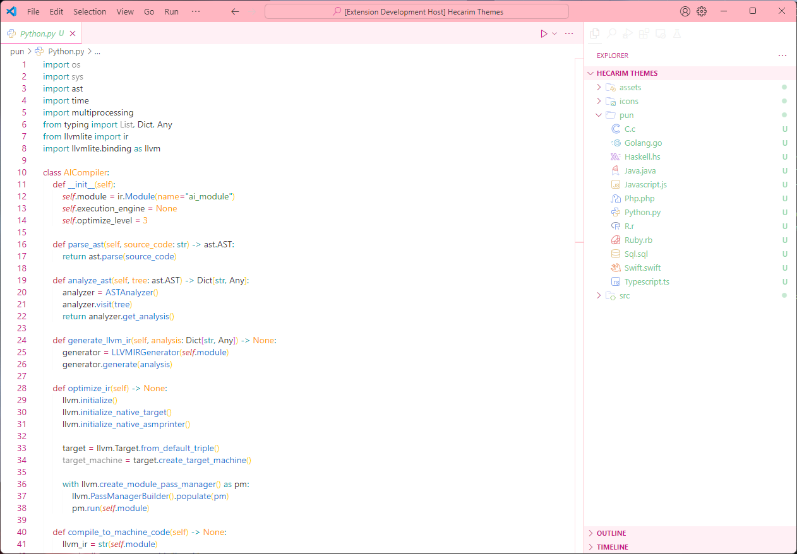
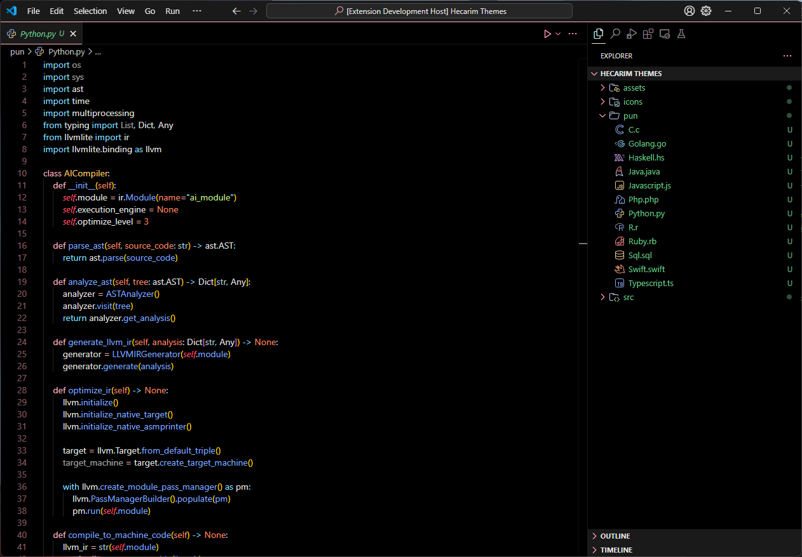

    

# 🎨 Hecarim Themes for VS Code 🖌️

*Elevate your coding experience with the versatile power of Hecarim Themes*

## 🌈 Theme Variations

Hecarim Themes offers a diverse palette to suit every coding mood and environment:

- **Hecarim Dark**: Embrace the shadows with our sleek dark theme
- **Hecarim Light**: Illuminate your code with our crisp light theme
- **Hecarim Beige**: Enjoy a warm, soothing atmosphere for your projects
- **Hecarim Purple**: Infuse your workspace with regal, creative energy
- **Hecarim Light Pink**: Add a touch of delicate charm to your coding sessions
- **Hecarim Dark Pink**: Dive into a rich, vibrant coding experience

## ✨ Features

- 🎨 Six carefully crafted color schemes for every preference
- 👁️ Optimized for reduced eye strain during long coding sessions
- 🚀 Syntax highlighting that makes your code pop
- 💎 Beautiful UI elements that complement each theme
- 🔧 Customizable accent colors to match your style
- 🌓 Easy switching between light and dark modes

## 📸 Screenshots

Hecarim Dark

Hecarim Light

Hecarim Beige

Hecarim Purple

Hecarim Light Pink

Hecarim Dark Pink

## 🚀 Installation

1. Open **VS Code**
2. Launch the **Command Palette** (\`Ctrl+Shift+P\` or \`Cmd+Shift+P\` on macOS)
3. Type \`ext install YourPublisherName.hecarim-themes\`
4. Click **Install**
5. Click **Reload** to activate

## 🎨 Customization

Hecarim Themes support customization! Add these to your \`settings.json\` to personalize your experience:

\`\`\`json
"workbench.colorCustomizations": {
    "[Hecarim Dark]": {
        "activityBar.background": "#1E1E1E",
        "sideBar.background": "#252526",
        // Add more customizations here
    },
    "[Hecarim Light]": {
        "activityBar.background": "#F5F5F5",
        "sideBar.background": "#FFFFFF",
        // Add more customizations here
    },
    // Add customizations for other themes...
}
\`\`\`
      `}
    

  );
}
